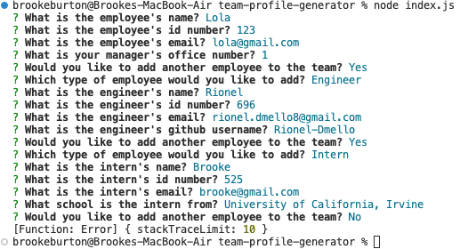
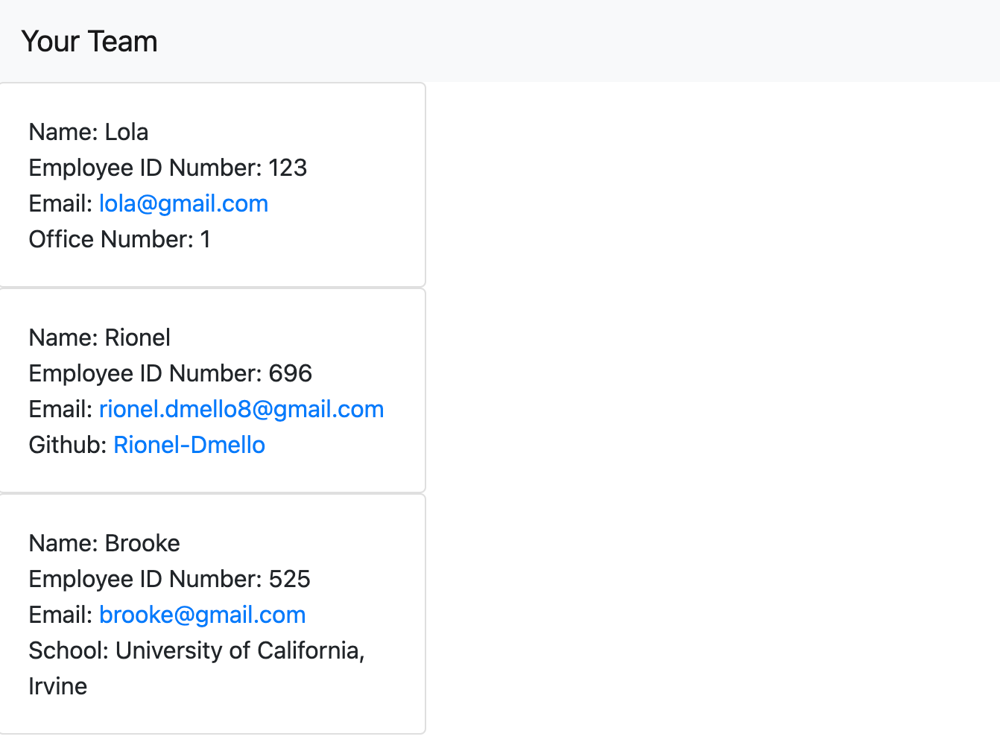

# team-profile-generator

## This application was created in order to allow computer science teams to create an HTML file/website that allows them to keep track of who is on their team and their info. By working on this project, i have learned how to utilize backend processes such as Node.js, inquirer and fs.

## Links

- https://drive.google.com/file/d/1ODrCdX4ifmmWC7AGr4tXh9HJxCYdvmIO/view
- https://github.com/bburton5/team-profile-generator

## Usage

This generator can be used to create a quality, professional team roster easily by taking in user inputs.

## Credits

- Stackoverflow
- MDN
- w3schools
